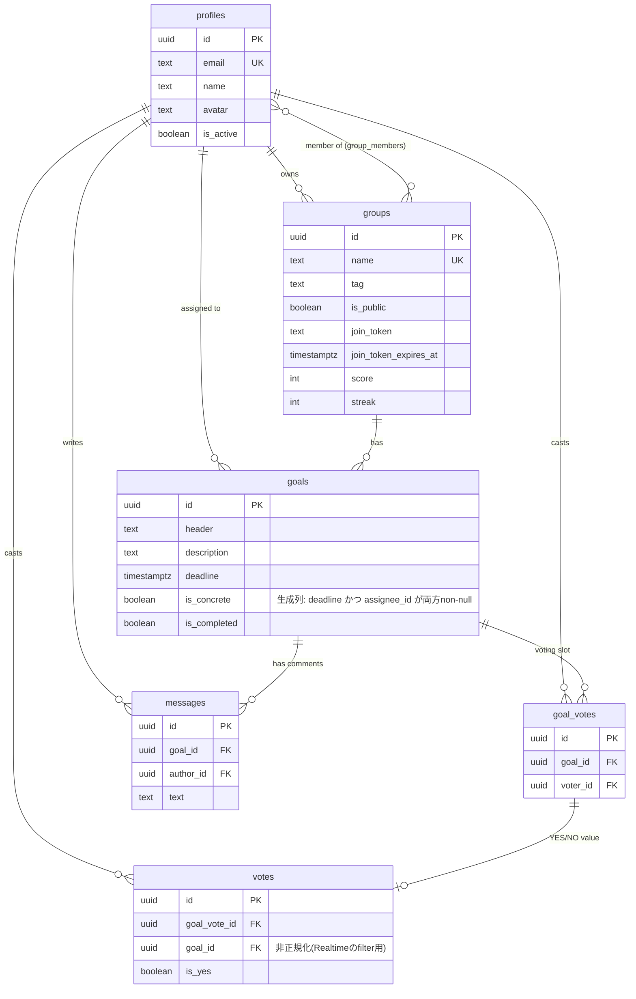

# ドメインモデル

`supabase/migrations/0001_init.sql` を正としたエンティティ関連図。

## エンティティの役割

| テーブル | 役割 |
| --- | --- |
| `profiles` | アカウント。`auth.users`作成時にトリガー(`handle_new_user`)で自動作成される。`name`は表示名(任意)、未設定時はメールアドレスをフォールバック表示 |
| `groups` | 目標を共有するチーム。`score`/`streak`を保持 |
| `group_members` | グループとユーザーの中間テーブル(オーナーは`groups.owner_id`で別管理、メンバーはここに含む) |
| `goals` | Group内の目標。`deadline`と`assignee_id`の両方があると「具体的な目標」(`is_concrete`、生成列)として扱われ、スコア計算で優遇される |
| `goal_votes` | 「投票席」。Goal×Userの組で1つだけ存在し(`unique(goal_id, voter_id)`)、投票取り消し時もこのレコード自体は残る |
| `votes` | 実際のYES/NO値。`goal_votes`に対して1:1。投票取り消しはこのレコードのみ削除される |
| `messages` | Goalに紐づくコメント |

## ビジネスロジックの置き場所

Express+Prisma時代はNode側にあったバリデーション・権限チェック・スコア計算を、SECURITY DEFINERなPostgres関数(RPC)に集約している。フロントエンドは`supabase.rpc(...)`経由でこれらを呼ぶだけで、テーブルへの直接のinsert/update/deleteポリシーは用意していない(読み取りのみRLSで許可)。

- `is_group_member(group_id)`: オーナー or メンバーかどうかの判定ヘルパー
- `cast_vote` / `cancel_vote`: 投票の登録・取り消し、達成判定(90%閾値)、スコア再計算のトリガー
- `recalc_group_score`: `docs/score-design.md`のスコア/ストリーク計算式をそのまま移植
- `create_invite` / `join_group`: 招待トークンの発行・検証(暗号化はせず、ランダムトークン+有効期限カラムで管理)

## 投票と進捗計算の関係

- **進捗率** (`calc_vote_progress`): YES票の数 ÷ グループの全メンバー数。90%以上で達成扱い
- **参加率ボーナス**: YES/NO問わず投票した人数 ÷ 全メンバー数が100%なら1.5倍
- この2つは分母は同じ(全メンバー数)だが分子の定義が異なる(YESのみ／YES・NO問わず)点に注意。詳細は `docs/score-design.md`

## 未解決の設計課題

- `goal_votes`/`votes`の分離は投票取り消しの意味論(席は残すが値は消す)のために存在するが、統合すべきかは未検討
- missed判定の遅延評価(誰かが投票操作するまでスコアに反映されない)は移行前から続く既知の制約。`pg_cron`等での定期再計算は未実装
