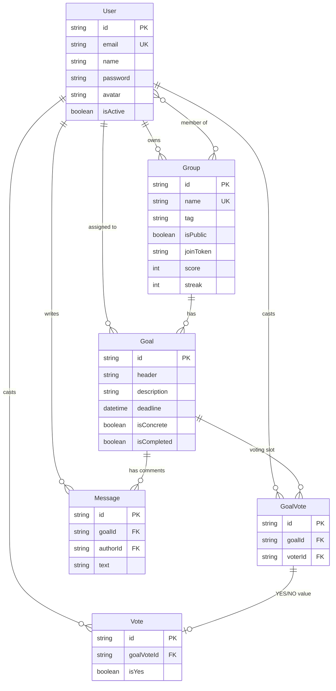

# ドメインモデル

`backend/prisma/schema.prisma` を正としたエンティティ関連図。

## エンティティの役割

| モデル | 役割 |
| --- | --- |
| `User` | アカウント。`name`は表示名(任意)、未設定時はメールアドレスをフォールバック表示 |
| `Group` | 目標を共有するチーム。`score`/`streak`を保持 |
| `Goal` | Group内の目標。`deadline`と`assigneeId`の両方があると「具体的な目標」(`isConcrete`)として扱われ、スコア計算で優遇される |
| `GoalVote` | 「投票席」。Goal×Userの組で1つだけ存在し(`@@unique([goalId, voterId])`)、投票取り消し時もこのレコード自体は残る |
| `Vote` | 実際のYES/NO値。`GoalVote`に対して1:1。投票取り消しはこのレコードのみ削除される |
| `Message` | Goalに紐づくコメント |

## 投票と進捗計算の関係

- **進捗率** (`calcProgress`): YES票の数 ÷ グループの全メンバー数。90%以上で達成扱い
- **参加率ボーナス** (`calcGoalPoints`): YES/NO問わず投票した人数 ÷ 全メンバー数が100%なら1.5倍
- この2つは分母は同じ(全メンバー数)だが分子の定義が異なる(YESのみ／YES・NO問わず)点に注意。詳細は `docs/score-design.md`

## 未解決の設計課題

- `GoalVote`/`Vote`の分離は投票取り消しの意味論(席は残すが値は消す)のために存在するが、統合すべきかは未検討(レベル2で見送り済み)
